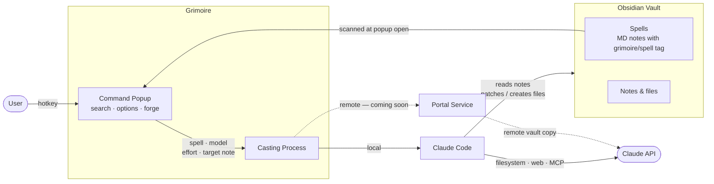
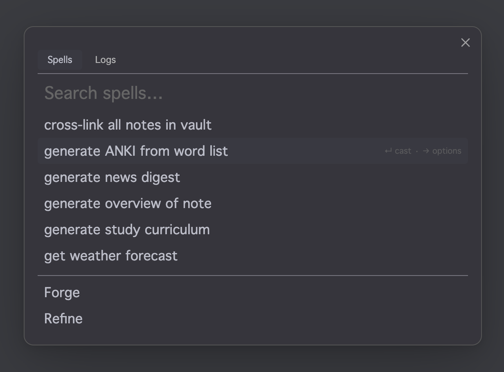
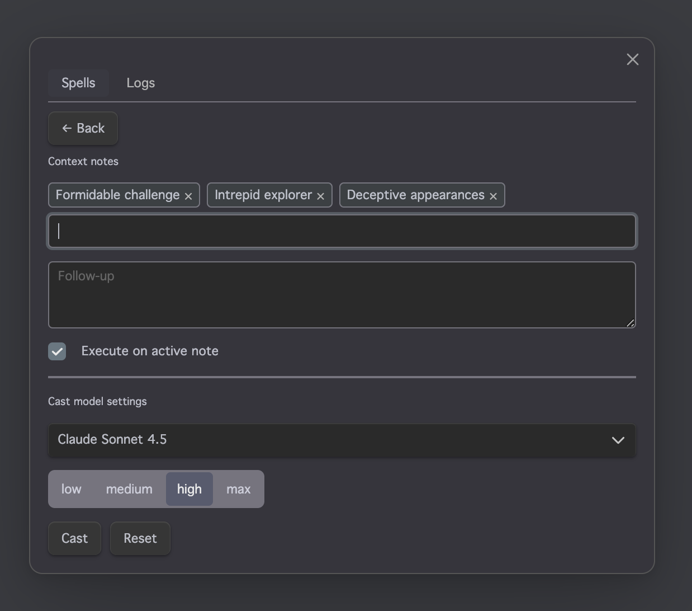
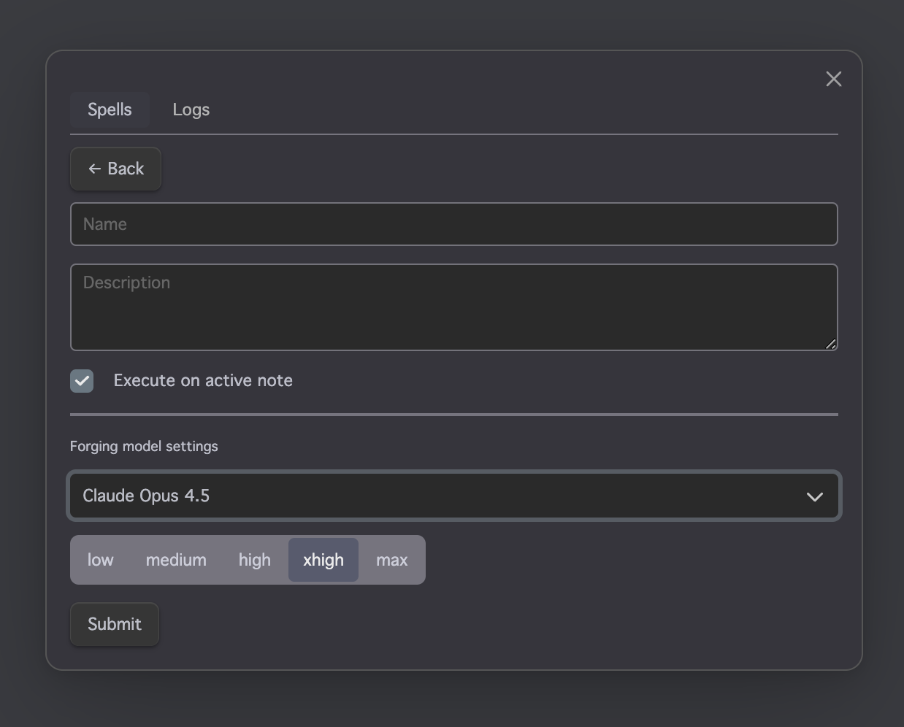
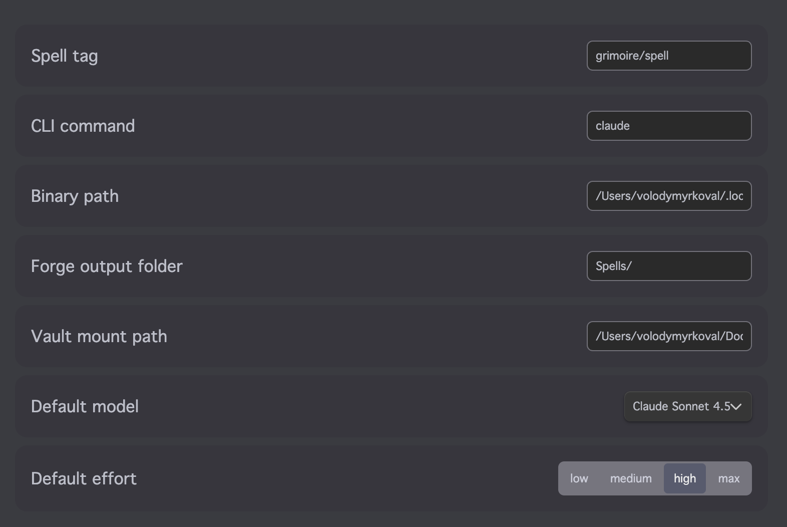

# Grimoire

> A grimoire for your notes.

> Work in progress, built for personal use. Expect missing features and rough edges. Desktop only for now.

---

## The problem

I had a growing list of routine tasks around my Obsidian vault — enriching notes with web data, extracting facts from sources, generating Anki cards from vocabulary lists. Each time I'd open a Claude tab, paste some context, type a prompt, wait, copy the result back. It worked, but it was the same ritual every time for the same recurring tasks.

I wanted to automate those. Describe a task once, give it a name, and invoke it with a keystroke whenever I need it.

---

## How it started

Before building a plugin, I wired this up manually. A [QuickAdd](https://github.com/chhoumann/quickadd) macro sent an HTTP request to a small bridge running on my VPS. The bridge received it and spawned `claude -p` as a subprocess, passing a vault note as the system prompt. Claude read and wrote files back through MCP. The result landed in the vault a minute later.

```
Obsidian (any device)
  │  QuickAdd macro → HTTP GET
  ▼
my-bridge.example.com (Caddy + basic auth)
  │  subprocess
  ▼
claude -p
  │  MCP
  ▼
mcp-obsidian → Obsidian REST API → Vault
```

It was fire-and-forget, it worked from any device, and it handled real tasks — enriching movie notes with web metadata, extracting facts from sources, generating Anki cards. The instruction notes were just vault files with a special tag; writing a new "macro" meant writing a new note.

It held up, but the setup was heavier than it needed to be for desktop use. The VPS bridge was there because I wanted it to work from any device, but when sitting at a laptop with Claude Code already installed, routing through a remote service felt like unnecessary infrastructure. QuickAdd picked up all tagged instruction notes automatically — that part worked — but the UX was still QuickAdd's generic macro interface, not something purpose-built for this.

So I wrote a plugin that keeps the same instruction-as-note idea, skips the bridge, and adds a proper search popup.

---

## Design goal

I use this daily, which means I'm also testing it daily. When something takes more steps than it should, or when the keyboard flow breaks, I notice — and that friction goes into the backlog.

The goal is simple: casting a spell should feel as fast as running a terminal command. Hotkey, type a few letters, Enter, back to writing. The spells carry all the flexibility — they can do anything Claude Code can do. The plugin's job is just to run them and stay out of the way.

---

## What it is

A **spell** is a vault note tagged with your spell tag (default: `grimoire/spell`). Any markdown file with that tag appears in the popup automatically. Write a spell once, cast it from any note with a keystroke — no copy-paste, no prompt retyping.

The plugin is a thin layer on top of `claude -p`. Spells are plain markdown — you can run them from the terminal too, with no Grimoire dependency.

---

## How it works



When you open the popup and pick a spell, the plugin builds a `claude -p` invocation with the spell, your selected model and effort level, and an optional target note, then runs it as a background process. The popup closes immediately.

Claude Code does the rest — reads your vault, calls MCP servers, fetches URLs, writes files back. Everything a Claude Code session can do from the command line, triggered from a keystroke inside Obsidian.

For now, casting runs locally: Claude Code must be installed on the same machine as Obsidian. Remote casting — so spells can be triggered from mobile or any HTTP client — is the next planned step, roughly equivalent to rebuilding the VPS bridge as a first-class feature.

---

## What you can do today

### Browse and cast spells

Open the Command Popup with a hotkey, type to fuzzy-search your spell library, arrow to select, `Enter` to cast. The popup closes and the cast runs in the background.



### Tune each cast with the options panel

Press `→` on any highlighted spell to open its options panel. Pick context notes to inject into the prompt, add a follow-up instruction, swap model or effort level. Tick **Set as default** to remember your model and effort choice for that spell — the next cast pre-fills automatically.



### Forge new spells

Select **Forge** at the bottom of the spell list. Describe what you want your spell to do in plain English, give it a name, and submit. Grimoire invokes Claude to write the spell file into your vault.



### Control whether a spell targets your active note

Every spell carries an **Execute on active note** flag — set when forging, overridable per-cast from the options panel. When enabled (the default), the spell receives your current note as context and requires one to be open. Disable it for spells that work standalone: web fetches, vault-wide tasks, daily digests.

### Configure from Obsidian settings

Set your spell tag, Claude Code binary path, default model and effort level, Forge output folder, and vault mount path under **Settings → Grimoire**.



---

## What's not there yet

- **Cast Log** — a live-updating record of every cast with status, expandable output, filter, and delete. See what's running, what finished, what errored.
- **Refine Note** — a built-in spell that rewrites or expands your active note. Supports inline `@cast` directives for surgical edits without leaving the editor.
- **Remote casting** — run spells from mobile or any HTTP client through a lightweight HTTP proxy. No local Claude Code required on the casting device.
- Per-spell override indicators, status bar, re-cast from log, scheduled casting.

---

## Requirements

- **Obsidian** desktop app (macOS, Windows, or Linux)
- **Claude Code** — the `claude` CLI, installed and reachable from your system PATH (or configured via Binary path in settings)
- An active Anthropic API key

> Mobile is not supported yet. Remote casting (coming soon) will be the path to casting from mobile.

---

## Installation

Grimoire is not yet listed in the Obsidian community plugin registry. Install via **BRAT**:

1. Install [BRAT](https://github.com/TfTHacker/obsidian42-brat) from the Obsidian community plugins.
2. In BRAT settings, click **Add Beta Plugin** and paste this repository's URL.
3. Enable **Grimoire** under **Settings → Community plugins**.

---

## Claude Code setup

Spells run via Claude Code with full tool access. To let them execute fire-and-forget — without Claude Code pausing to ask for permission on every tool call — create a `.claude/settings.local.json` file in your **vault's root directory**:

```json
{
  "permissions": {
    "allow": [
      "Bash(find:*)",
      "Bash(grep:*)",
      "Bash(ls:*)",
      "mcp__obsidian-mcp-tools__get_server_info",
      "mcp__obsidian-mcp-tools__get_vault_file",
      "mcp__obsidian-mcp-tools__search_vault",
      "mcp__obsidian-mcp-tools__search_vault_simple",
      "mcp__obsidian-mcp-tools__create_vault_file",
      "Read",
      "Edit",
      "Write",
      "MultiEdit",
      "WebFetch",
      "WebSearch"
    ],
    "deny": [
      "Bash(rm -rf *)"
    ]
  }
}
```

| Permission | What it allows |
|---|---|
| `Bash(find:*)`, `Bash(grep:*)`, `Bash(ls:*)` | Locate and search files in the vault |
| `mcp__obsidian-mcp-tools__*` | Read, search, and create vault notes via Obsidian MCP |
| `Read`, `Edit`, `Write`, `MultiEdit` | Read and write files on disk |
| `WebFetch`, `WebSearch` | Fetch URLs and search the web |
| `Bash(rm -rf *)` *(denied)* | Guard against destructive deletes |

Without this file, Claude Code will prompt for confirmation on every tool call. Since spells run as background processes with no terminal attached, those prompts can't be answered — the cast will stall or fail. Expand or restrict the list to match what your spells actually need.
